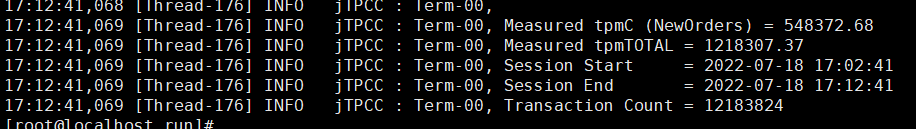

 

# 用户态协议栈Gazelle

## 简介

Gazelle是一款高性能用户态协议栈。它基于DPDK在用户态直接读写网卡报文，共享大页内存传递报文，使用轻量级LwIP协议栈。能够大幅提高应用的网络I/O吞吐能力。专注于数据库网络性能加速，如MySQL、redis等。兼顾高性能与通用性：
- 高性能  
报文零拷贝，无锁，灵活scale-out，自适应调度。
- 通用性  
完全兼容POSIX，零修改，适用不同类型的应用。  

单进程且网卡支持多队列时，只需使用liblstack.so有更短的报文路径。其余场景使用ltran进程分发报文到各个线程。

## 性能效果
### mysql
 
 

使用内核协议栈跑分为54.84万，使用Gazelle跑分为66.85万，Gazelle提升20%+。详见[实践系列(一):Gazelle加速mysql 20%](doc/%E5%AE%9E%E8%B7%B5%E7%B3%BB%E5%88%97(%E4%B8%80)Gazelle%E5%8A%A0%E9%80%9Fmysql%2020%25.md)

### redis
2022/7/29发布 

### nginx
2022/8/12发布 

### openGauss
2022/8/17发布 
## 详情 
可点击标题跳转，欢迎投递文章、提意见。
| 主题 | 内容简介 | 发布时间 |
|:---|:-----|:---|
|[Gazelle使用指南](doc/Gazelle%E4%BD%BF%E7%94%A8%E6%8C%87%E5%8D%97.md)| 1，安装、部署环境、启动应用程序 2，配置参数说明 3，调测命令说明 4，使用约束、风险、注意事项|已发布|
|Gazelle介绍| 1，介绍背景 2，简介技术方案 3，性能效果|2022/8/5|
|[实践系列(一):Gazelle加速mysql 20%](doc/%E5%AE%9E%E8%B7%B5%E7%B3%BB%E5%88%97(%E4%B8%80)Gazelle%E5%8A%A0%E9%80%9Fmysql%2020%25.md)|1，详细测试步骤 2，性能效果|2022/7/22|
|实践系列(二):Gazelle加速redis xx|1，详细测试步骤 2，性能效果|2022/7/29|
|实践系列(三):Gazelle加速nginx xx|1，详细测试步骤 2，性能效果|2022/8/12|
|实践系列(四):Gazelle加速openGauss xx|1，详细测试步骤 2，性能效果|2022/8/17|
|解读系列(一):Gazelle总体方案介绍|1，支持场景、特性、规格 2，与dpdk、lwip关系 3，总体框架 4，替换posix接口|2022/8/17|
|解读系列(二):Gazelle为什么能提升xx|介绍提关键技术点：减少拷贝、亲和性、减少上下文切换|2022/9/2|
|解读系列(三):Gazelle代码框架流程|1，Gazelle框架 2，事件、读、写、ltran报文流程图|2022/9/9|
|参与Gazelle指导|1，怎么判断应用适不适合应gazelle加速 2，Gazelle常见问题调试 |2022/8/5|
|[openEuler指南](https://gitee.com/openeuler/community/blob/master/zh/contributors/README.md)| 如何参与openEuler社区 | 已发布 |
## 路标
#### 近期
- 完成openGauss调试验证 --- 2022.7.23
- 完成GRO、GSO、LRO、TSO大包优化 --- 2022.7.30
- 完成mysql、redis、nginx、openGauss调试，输出详细测试文档 --- 2022.8.17
- 与dpdk、lwip进一步解耦 --- 2022.8.31
- 小包聚合优化 --- 2022.8.31

#### 远期
- 报文输入可配，当前只能使用dpdk从网卡读取报文，后续可选XDP、智能网卡、RDMA等
- lwip可配，当前报文都会经过lwip处理，后续可配是否使用lwip
- 支持容器场景

## 联系方式
[注册邮件列表](https://mailweb.openeuler.org/postorius/lists/high-performance-network.openeuler.org/)  
[历史邮件](https://mailweb.openeuler.org/hyperkitty/list/high-performance-network@openeuler.org/)  
微信群名称：openEuler 高性能网络sig  
[SIG首页](https://gitee.com/wu-changsheng/community/tree/master/sig/sig-high-performance-network)