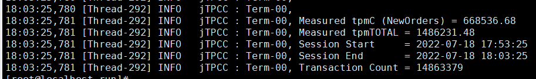

 

# 用户态协议栈Gazelle

## 简介

Gazelle是一款高性能用户态协议栈。它基于DPDK在用户态直接读写网卡报文，共享大页内存传递报文，使用轻量级LwIP协议栈。能够大幅提高应用的网络I/O吞吐能力。专注于数据库网络性能加速，如MySQL、redis等。兼顾高性能与通用性：
- 高性能  
报文零拷贝，无锁，灵活scale-out，自适应调度。
- 通用性  
完全兼容POSIX，零修改，适用不同类型的应用。  

## 性能效果
### mysql 8.0.20
 
 

使用内核协议栈跑分为54.84万，使用Gazelle跑分为66.85万，Gazelle提升20%+  

### ceph 14.2.8
 

4k整机场景，Gazelle提升20%+  

## 详情 
可点击标题跳转，欢迎投递文章、提意见。
| 主题 | 内容简介 | 发布时间 |
|:---|:-----|:---|
|[openEuler指南](https://gitee.com/openeuler/community/blob/master/zh/contributors/README.md)| 如何参与openEuler社区 | 已发布 |
|[Gazelle用户指南](doc/user-guide.md)| 1. 安装、部署环境、启动应用程序 2. 配置参数说明 3. 调测命令说明 4. 使用约束、风险、注意事项|已发布|
|[Gazelle开发者指南](doc/programmer-guide.md)| 1. 技术原理 2. 架构设计| 待定 |
|[实践系列-Gazelle加速mysql 20%](doc/%E5%AE%9E%E8%B7%B5%E7%B3%BB%E5%88%97-Gazelle%E5%8A%A0%E9%80%9Fmysql.md)|1. 详细测试步骤 2. 性能效果|已发布|
|[实践系列-Gazelle加速ceph client 20%](https://www.hikunpeng.com/document/detail/zh/kunpengcpfs/basicAccelFeatures/storageAccel/kunpengcpfs_hpcd_0002.html)|1. 详细测试步骤 2. 性能效果|已发布|
|实践系列-Gazelle加速redis |1. 详细测试步骤 2. 性能效果| 待定 |
|实践系列-Gazelle加速openGauss |1. 详细测试步骤 2. 性能效果| 待定 |

## 支持列表
- [posix接口列表及应用支持列表](doc/support.md)

## FAQ
- [如何使用pdump工具抓包](doc/pdump.md) 
- [多进程各自独立使用网卡](doc/multiple-nic.md)

## 路标
TODO

## 联系方式
[订阅邮件列表](https://mailweb.openeuler.org/postorius/lists/high-performance-network.openeuler.org/)  
[历史邮件](https://mailweb.openeuler.org/hyperkitty/list/high-performance-network@openeuler.org/)  
[SIG首页](https://gitee.com/openeuler/community/tree/master/sig/sig-high-performance-network)  