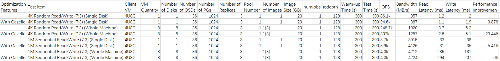

# User-Space Protocol Stack Gazelle

[简体中文](README.md) | [English](README_en.md)

## Introduction

Gazelle is a high-performance user-space protocol stack. It is based on DPDK for directly reading and writing network packets in user space, sharing large-page memory to transmit packets, and using the lightweight LwIP protocol stack. It significantly improves the network I/O throughput of applications, focusing on accelerating database network performance, such as MySQL and Redis, while balancing high performance and generality:
- High Performance  
Zero-copy packet processing, lock-free, flexible scale-out, adaptive scheduling.
- Generality  
Fully POSIX-compatible, no modifications required, suitable for different types of applications.

## Performance Results

### MySQL 8.0.20
 
 

The score using the kernel protocol stack is 548,400, while using Gazelle, it is 668,500, an improvement of over 20%.

### Ceph 14.2.8
 

In the 4k full-machine scenario, Gazelle improves performance by over 20%.

## Details 
Click on the titles for more details. Contributions and feedback are welcome.
| Topic | Summary | Publication Date |
|:---|:-----|:---|
|[openEuler Guide](https://gitee.com/openeuler/community/blob/master/en/contributors/README.md)| How to participate in the openEuler community | Published |
|[Gazelle User Guide](doc/user-guide_en.md)| 1. Installation, deployment environment, application startup 2. Parameter configuration explanation 3. Debugging command explanation 4. Usage constraints, risks, considerations|Published|
|[Gazelle Developer Guide](doc/programmer-guide_en.md)| 1. Technical principles 2. Architecture design| To be determined |
|[Practice Series - Gazelle Accelerating MySQL by 20%](doc/Practice_Series_Gazelle_Accelerates_MySQL.md)|1. Detailed testing steps 2. Performance results|Published|
|[Practice Series - Gazelle Accelerating Ceph Client by 20%](https://www.hikunpeng.com/document/detail/zh/kunpengcpfs/basicAccelFeatures/storageAccel/kunpengcpfs_hpcd_0002.html)|1. Detailed testing steps 2. Performance results|Published|
|[Practice Series - Gazelle Accelerating Redis](doc/redis_en.md) |1. Detailed testing steps 2. Performance results| Published |
|Practice Series - Gazelle Accelerating openGauss |1. Detailed testing steps 2. Performance results| To be determined |
|[Practice Series - Gazelle Supporting Netperf Performance Testing](doc/netperf_en.md)| 1. Version description  2. Detailed testing steps| To be determined |

## Support List
- [POSIX interface list and application support list](doc/support_en.md)

## FAQ
- [How to use the pdump tool for packet capture](doc/pdump_en.md) 
- [Using multiple processes independently with NICs](doc/multiple-nic_en.md)

## Contact Information
[Subscribe to the mailing list](https://mailweb.openeuler.org/postorius/lists/high-performance-network.openeuler.org/)  
[Archived emails](https://mailweb.openeuler.org/hyperkitty/list/high-performance-network@openeuler.org/)  
[SIG Homepage](https://gitee.com/openeuler/community/tree/master/sig/sig-high-performance-network)  
