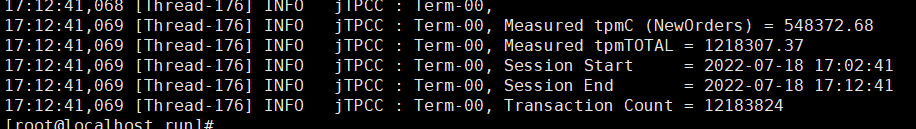
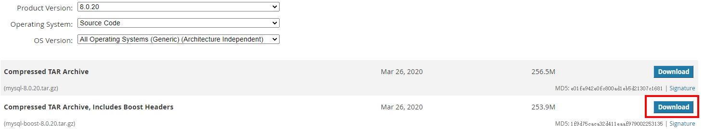

# Practice Series (Part 1) Gazelle Accelerates MySQL by 20%

## Background Introduction

The current improvement in network card performance far outpaces that of single-core CPUs. Single-core CPUs are no longer able to fully utilize the bandwidth dividend of network cards. Meanwhile, CPUs are evolving towards multi-core direction, and NUMA architecture is one of the multi-core solutions. From a hardware perspective, there are mainly two solutions to bridge the computational gap between CPU and network card: offloading CPU work to the network card, a hardware acceleration solution; and making full use of the NUMA architecture, a software acceleration solution. It may be instinctive to think that hardware acceleration is faster, but in practical tests, Gazelle software acceleration achieves greater performance improvement, especially in the segment where data efficiently transfers to applications, Gazelle handles it better.


Currently, there is a wide variety of software programming models, but they can be summarized into two typical network models, as shown below:
- IO multiplexing model: Application A's network threads are completely isolated from each other, and protocol state contexts are fixed within a thread.
- Asymmetric model: Application B's network threads are asymmetric, and protocol state contexts migrate across multiple threads.


## Challenges in Improving MySQL Performance

MySQL's network model belongs to the aforementioned asymmetric model, where TCP migrates across threads. Common user-space protocol stacks in the industry are designed for asymmetric applications (such as f-stack), which cannot support TCP migration across threads, or they use global TCP resources (such as lwip). When the number of connections exceeds 40, performance rapidly deteriorates due to competition issues.

 

## Gazelle Solution

Gazelle is a high-performance user-space protocol stack. It directly reads and writes network packets in user space based on DPDK, shares large page memory for packet transmission, and uses lightweight LwIP protocol stack. It can significantly improve the network I/O throughput of applications, focusing on accelerating database network performance, such as MySQL, Redis, etc. It balances high performance with versatility:
- High performance: Zero-copy of packets, lock-free, flexible scale-out, adaptive scheduling.
- Versatility: Fully compatible with POSIX, zero modifications, suitable for different types of applications.

Gazelle decouples application threads from protocol stack threads, thereby supporting any thread model. Through the routing table of application thread fd and protocol stack thread sock, operations such as read/write of application threads can be executed in the corresponding protocol stack threads. Gazelle is deployed in a multi-core multi-threaded manner, avoiding NUMA traps through regionalized large page memory.


- POSIX compatibility
- DPDK bypass kernel
- Regionalized large page memory management to avoid NUMA traps
- Application thread affinity management
- Distributed TCP Hash table, multi-core multi-threaded working mode
- Decoupling of protocol stack threads and application threads
- Efficient transmission of packets to applications

 

As shown, using the kernel protocol stack achieves a score of 548,400, while using Gazelle achieves a score of 668,500, an increase of 20%+.

## Steps to Accelerate MySQL with Gazelle

### 1. Environment Requirements

#### 1.1 Hardware

One server (Server) and one client (Client) are required.

|          |          Server          |         Client          |
| :------- | :----------------------: | :---------------------: |
| CPU      |   Kunpeng 920-4826 * 2   |  Kunpeng 920-4826 * 2   |
| Frequency|         2600MHz          |         2600MHz         |
| Memory   | 12 * 32G Micron 2666 MHz | 8 * 32G Micron 2666 MHz |
| Network  |         1822 25G         |        1822 25G         |
| System Disk |     1.1T HDD TOSHIBA  |    1.1T HDD TOSHIBA     |
| Data Disk |    3T HUAWEI SSD NVME   |           NA            |

#### 1.2 Software

The software package defaults to using openEuler 22.03 yum source.

|   Software Name   |  Version  |
| :---------------: | :-------: |
|       mysql       |  8.0.20   |
|   benchmarksql    |    5.0    |

#### 1.3 Networking


### 2. Server-Side Deployment

#### 2.1 Install MySQL Dependencies

```sh
yum install -y cmake doxygen bison ncurses-devel openssl-devel libtool tar rpcgen libtirpc-devel bison bc unzip git gcc-c++ libaio libaio-devel numactl
```

#### 2.2 Compile and Install MySQL

- Download the source code package from the [official website](https://downloads.mysql.com/archives/community/).



- Download optimization patches: [Fine-grained lock optimization feature patch](https://github.com/kunpengcompute/mysql-server/releases/download/tp_v1.0.0/0001-SHARDED-LOCK-SYS.patch), [NUMA scheduling patch](https://github.com/kunpengcompute/mysql-server/releases/download/21.0.RC1.B031/0001-SCHED-AFFINITY.patch), [Lock-free optimization feature patch](https://github.com/kunpengcompute/mysql-server/releases/download/tp_v1.0.0/0002-LOCK-FREE-TRX-SYS.patch).

- Compile MySQL

  Ensure that the `libaio-devel` package is installed before compiling.

```sh
tar zxvf mysql-boost-8.0.20.tar.gz
cd mysql-8.0.20/
patch -p1 < ../0001-SHARDED-LOCK-SYS.patch
patch -p1 < ../0001-SCHED-AFFINITY.patch
patch -p1 < ../0002-LOCK-FREE-TRX-SYS.patch
cd cmake
make clean
cmake .. -DCMAKE_INSTALL_PREFIX=/usr/local/mysql-8.0.20  -DWITH_BOOST=../boost -DDOWNLOAD_BOOST=1
make -j 64
make install
```

#### 2.3 Configure MySQL Parameters

Use the `my.cnf-arm` configuration file from the Gazelle source code's `doc/conf/` directory. Place it in the `/etc` directory and rename it to `my.cnf`.

#### 2.4 Deploy MySQL

```sh
# Mount the NVMe disk
mkdir -p /data
mount  /dev/nvme0n1 /data
mkdir -p /data/mysql
mkdir -p /data/mysql/data
mkdir -p /data/mysql/share
mkdir -p /data/mysql/tmp
mkdir -p /data/mysql/run
mkdir -p /data/mysql/log

# Create user group
groupadd mysql
useradd -g mysql mysql
chown -R mysql:mysql /data
chown -R mysql:mysql /data/mysql/log/mysql.log

# Initialize
echo "" > /data/mysql/log/mysql.log
rm -fr /data/mysql/data/*
/usr/local/mysql-8.0.20/bin/mysqld  --defaults-file=/etc/my.cnf --user=root --initialize

# Start the service
/usr/local/mysql-8.0.20/support-files/mysql.server start

# After initialization, a random password is generated. Use it to log in to MySQL
/usr/local/mysql-8.0.20/bin/mysql -u root -p
alter user 'root'@'localhost' identified by '123456';
flush privileges;
quit

# Log in to the database again, password is '123456'. Update the root account to be able to access '%' domain, enabling remote access
/usr/local/mysql-8.0.20/bin/mysql -u root -p
use mysql;
update user set host='%' where user='root';
flush privileges;
create database tpcc;
quit

# Stop the service first, and then start it again to apply the configured changes
/usr/local/mysql-8.0.20/support-files/mysql.server stop
```

### 3. Deploying BenchmarkSQL Tool on the Client Side

- Compilation and Installation

Download the [BenchmarkSQL tool](https://mirrors.huaweicloud.com/kunpeng/archive/kunpeng_solution/database/patch/benchmarksql5.0-for-mysql.zip).

```sh
# Install dependencies for BenchmarkSQL
yum install -y java

unzip benchmarksql5.0-for-mysql.zip
cd benchmarksql5.0-for-mysql/run
chmod +x *.sh
```

- Configuring BenchmarkSQL Parameters

  Edit the `benchmarksql5.0-for-mysql/run/props.conf` file.

  | Configuration Item | Value | Description                                  |
  | ------------------ | ----- | -------------------------------------------- |
  | Terminals          | 300   | Number of concurrent connections for testing |
  | runMins            | 10    | Duration of the test in minutes              |
  | conn               | ip    | Modify the default IP to the server's IP     |

### 4. Creating Test Data in MySQL

```sh
# Start the MySQL service
/usr/local/mysql-8.0.20/support-files/mysql.server start

# Create test data (data creation takes about 45 minutes, after completing the data creation, it is recommended to backup the data under /data/mysql/data on the server side for future tests, data can be copied from here)
./runDatabaseBuild.sh props.conf

# Stop the database
/usr/local/mysql-8.0.20/support-files/mysql.server stop
```


### 5. Configuring the Execution Environment

#### 5.1 Enabling STEAL Optimization

Enable STEAL optimization on the server side.

1. Add the parameter `sched_steal_node_limit=4` to the Linux system startup parameters, and reboot to take effect.

```sh
[root@localhost mysql]# cat /proc/cmdline
BOOT_IMAGE=/vmlinuz-5.10.0-153.12.0.89.oe2203sp2.aarch64 root=/dev/mapper/openeuler-root ro rd.lvm.lv=openeuler/root rd.lvm.lv=openeuler/swap video=VGA-1:640x480-32@60me cgroup_disable=files apparmor=0 crashkernel=1024M,high smmu.bypassdev=0x1000:0x17 smmu.bypassdev=0x1000:0x15 console=tty0 sched_steal_node_limit=4 
```

2. Enable STEAL after rebooting.

```sh
echo STEAL > /sys/kernel/debug/sched_features
```

#### 5.2 Disabling Test Impacting Factors

```sh
# Disable irqbalance
systemctl stop irqbalance.service
systemctl disable irqbalance.service

# Disable firewall
systemctl stop iptables
systemctl stop firewalld
```

### 6. Kernel Protocol Stack Testing for MySQL

```sh
# Server-side interrupt binding (replace NIC name and CPU core according to the environment)
ethtool -L enp4s0 combined 5
irq1=`cat /proc/interrupts| grep -E enp4s0 | head -n5 | awk -F ':' '{print $1}'`
cpulist=(91 92 93 94 95)
c=0
for irq in $irq1
do
echo ${cpulist[c]} "->" $irq
echo ${cpulist[c]} > /proc/irq/$irq/smp_affinity_list
let "c++"
done

# Execute MySQL testing on the client side
./runBenchmark.sh props.conf

## Restore the environment
# Restore the database using backup data on the server side, or regenerate the data.
rm -fr /data/mysql/data/*
cp -fr /home/tpccdata/* /data/mysql/data/
# Shut down the MySQL process
pkill -9 mysqld
```

Test results are as follows:


### 7. Gazelle Testing for MySQL
Install software packages
```sh
yum -y install gazelle dpdk libconfig numactl libboundscheck libcap 
```

Modify the `/etc/gazelle/lstack.conf` configuration file as follows:

| Configuration Item | Value                                                        | Description                                               |
| ------------------ | ------------------------------------------------------------ | --------------------------------------------------------- |
| dpdk_args          | ["--socket-mem", "2048,2048,2048,2048", "--huge-dir", "/mnt/hugepages-lstack", "--proc-type", "primary", "--legacy-mem", "--map-perfect"] | Configure 2G memory usage for each NUMA (can be smaller), mount directory for huge pages |
| use_ltran          | 0                                                            | Do not use ltran                                          |
| listen_shadow      | 1                                                            | Use listen shadow FD, as one MySQL listen thread corresponds to 4 protocol stack threads |
| num_cpus           | "18,38,58,78"                                                | Choose one CPU for each NUMA                              |


```sh
# Server-side allocate huge pages
echo 8192 > /sys/kernel/mm/hugepages/hugepages-2048kB/nr_hugepages # Choose page size accordingly
mkdir -p /mnt/hugepages-lstack
mount -t hugetlbfs nodev /mnt/hugepages-lstack # Do not repeat, otherwise the huge pages will be occupied and cannot be released

# Load ko on the server
modprobe vfio enable_unsafe_noiommu_mode=1
modprobe vfio-pci

# Bind NIC to user space on the server
ip link set enp4s0 down
dpdk-devbind -b vfio-pci enp4s0

# Start mysqld on the server
LD_PRELOAD=/usr/lib64/liblstack.so GAZELLE_BIND_PROCNAME=mysqld /usr/local/mysql-8.0.20/bin/mysqld --defaults-file=/etc/my.cnf --bind-address=192.168.1.10 &

# Execute MySQL testing on the client side
./runBenchmark.sh props.conf

## Restore the environment
# Restore the database using backup data on the server side, or regenerate the data.
rm -fr /data/mysql/data/*
cp -fr /home/tpccdata/* /data/mysql/data/
# Shut down the MySQL process
pkill -9 mysqld
```
For detailed Gazelle deployment, refer to the [Gazelle User Guide](user-guide.md).

Test results are as follows:


