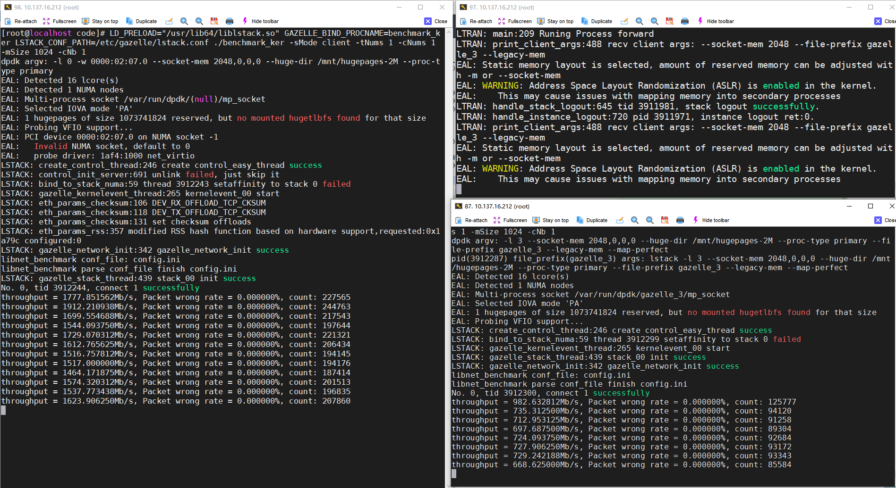

# Configuring Multiple Processes to Independently Use Network Cards

Gazelle supports the capability for multiple processes to independently utilize different network cards. This document illustrates the configuration method for scenarios where the lstack process and the ltran+lstack process independently use network cards, using the example provided.

## Configuration Steps:
### Configuration Explanation
- For the same process, the ltran.conf and lstack.conf files should have the same `unix_prefix` parameter. For instance, in the example, `unix_prefix=08` is used. Different processes should have different `unix_prefix` parameters; for example, `unix_prefix=07` in the example.
- Gazelle processes requiring different network cards need to be configured with different dpdk parameters, including:
  - `-a` (in dpdk-19.11, `-w`) specifying the PCI address whitelist of the bound network card.
  - `--file-prefix` specifying the shared directory name (any name, used to initialize and create directories).

### Binding Network Cards
- Bind multiple network cards with dpdk. In the example configuration below, enp2s7 (0000:02:07.0) and enp2s8 (0000:02:08.0) are bound to network cards.
```
[root@localhost ~]# dpdk-devbind -b igb_uio 0000:02:07.0
[root@localhost ~]# dpdk-devbind -b igb_uio 0000:02:08.0
[root@localhost ~]# dpdk-devbind -s

Network devices using DPDK-compatible driver
============================================
0000:02:07.0 'Virtio network device 1000' drv=igb_uio unused=
0000:02:08.0 'Virtio network device 1000' drv=igb_uio unused=
```

### Configuration for the First Process
- The first process utilizes only the lstack mode (this is just an example, any mode can be used) and runs on enp2s7.
  Below is the configuration file for dpdk-21.11. For dpdk-19.11, replace `-a` with `-w`.
```
[root@localhost ~]# cat /etc/gazelle/lstack.conf
dpdk_args=["-l", "0", "-a", "0000:02:07.0", "--socket-mem", "2048,0,0,0", "--huge-dir", "/mnt/hugepages-2M", "--proc-type", "primary", "--file-prefix", "07"]

use_ltran=0
kni_switch=0

low_power_mode=0
listen_shadow=1
unix_prefix="07"

num_cpus="1"

host_addr="192.168.1.2"
mask_addr="255.255.255.0"
gateway_addr="192.168.1.1"
devices="aa:bb:cc:dd:ee:ff"
```

### Configuration for the Second Process
- The second process utilizes the lstack+ltran mode (this is just an example, any mode can be used) and runs on enp2s8.
  Below is the configuration file for dpdk-21.11. For dpdk-19.11, replace `-a` with `-w`.
```
[root@localhost ~]# cat /etc/gazelle/ltran.conf
forward_kit="dpdk"
forward_kit_args="-l 1 -a 0000:02:08.0 --socket-mem 1024,0,0,0 --huge-dir /mnt/hugepages --proc-type primary --legacy-mem --map-perfect --syslog daemon --file-prefix 08"

kni_switch=0

dispatch_subnet="192.168.1.0"
dispatch_subnet_length=8
dispatch_max_clients=30
unix_prefix="08"

bond_mode=1
bond_miimon=100
bond_mtu=1500
bond_ports="0x1"
bond_macs="ff:ee:dd:cc:bb:aa"

tcp_conn_scan_interval=10
```

```
[root@localhost ~]# cat /etc/gazelle/lstack2.conf
dpdk_args=["-l", "3", "--socket-mem", "2048,0,0,0", "--huge-dir", "/mnt/hugepages-2M", "--proc-type", "primary", "--file-prefix", "18", "--legacy-mem", "--map-perfect"]

use_ltran=1
kni_switch=0

low_power_mode=0
listen_shadow=1
unix_prefix="08"

num_cpus="2"

host_addr="192.168.1.3"
mask_addr="255.255.255.0"
gateway_addr="192.168.1.1"
devices="ff:ee:dd:cc:bb:aa"
```

## Usage
- The two processes can independently send and receive data packets using different network cards.

