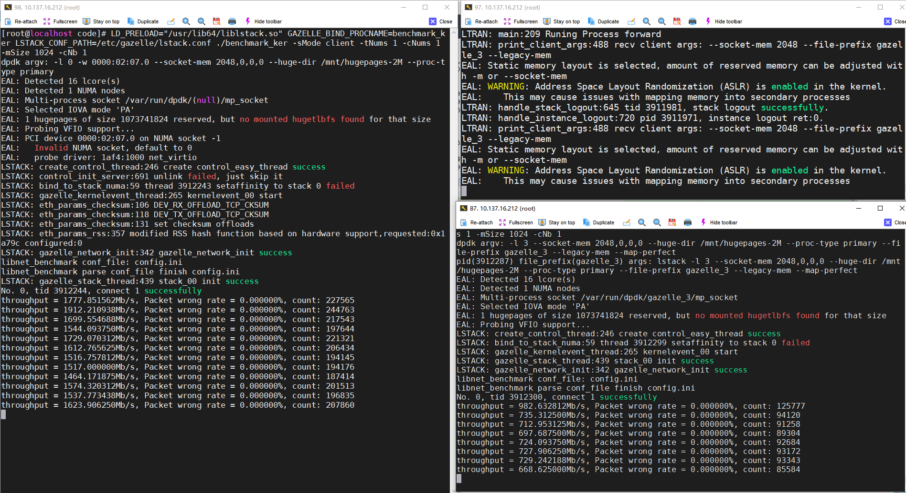

# 多进程各自独立使用网卡

gazelle多进程支持分别独立使用不同的网卡。本文档以lstack进程和ltran+lstack进程独立使用网卡为例，说明这种场景的配置方法。

## 配置步骤：
### 配置说明
- 同一个进程的ltran.conf和lstack.conf配置相同的`unix_prefix`参数，如示例中的`unix_prefix=08`。不同进程配置不同unix_prefix参数，如示例中的`unix_prefix=07`
- Gazelle进程不同网卡需要配置不同的dpdk参数，包括  
  `-a` (dpdk-19.11为`-w`) 指定绑定的网卡PCI地址白名单  
  `--file-prefix` 指定共享目录名称(任意名称，初始化创建目录)

### 绑定网卡
- dpdk绑定多个网卡，下面的示例配置中，绑定了enp2s7(0000:02:07.0)和enp2s8(0000:02:08.0)两张网卡
```
[root@localhost ~]# dpdk-devbind -b igb_uio 0000:02:07.0
[root@localhost ~]# dpdk-devbind -b igb_uio 0000:02:08.0
[root@localhost ~]# dpdk-devbind -s

Network devices using DPDK-compatible driver
============================================
0000:02:07.0 'Virtio network device 1000' drv=igb_uio unused=
0000:02:08.0 'Virtio network device 1000' drv=igb_uio unused=
```

### 第一个进程配置
- 第一个进程只使用lstack模式（只是示例，任意模式都可以）在enp2s7上运行  
  dpdk-21.11配置文件如下，dpdk-19.11把其中的-a替换成-w
```
[root@localhost ~]# cat /etc/gazelle/lstack.conf
dpdk_args=["-l", "0", "-a", "0000:02:07.0", "--socket-mem", "2048,0,0,0", "--huge-dir", "/mnt/hugepages-2M", "--proc-type", "primary", "--file-prefix", "07"]

use_ltran=0
kni_switch=0

low_power_mode=0
listen_shadow=1
unix_prefix="07"

num_cpus="1"

host_addr="192.168.1.2"
mask_addr="255.255.255.0"
gateway_addr="192.168.1.1"
devices="aa:bb:cc:dd:ee:ff"
```
### 第二个进程配置
- 第二个进程使用lstack+ltran模式（只是示例，任意模式都可以）在enp2s8上运行  
  dpdk-21.11配置文件如下，dpdk-19.11把其中的-a替换成-w
```
[root@localhost ~]# cat /etc/gazelle/ltran.conf
forward_kit="dpdk"
forward_kit_args="-l 1 -a 0000:02:08.0 --socket-mem 1024,0,0,0 --huge-dir /mnt/hugepages --proc-type primary --legacy-mem --map-perfect --syslog daemon --file-prefix 08"

kni_switch=0

dispatch_subnet="192.168.1.0"
dispatch_subnet_length=8
dispatch_max_clients=30
unix_prefix="08"

bond_mode=1
bond_miimon=100
bond_mtu=1500
bond_ports="0x1"
bond_macs="ff:ee:dd:cc:bb:aa"

tcp_conn_scan_interval=10
```

```
[root@localhost ~]# cat /etc/gazelle/lstack2.conf
dpdk_args=["-l", "3", "--socket-mem", "2048,0,0,0", "--huge-dir", "/mnt/hugepages-2M", "--proc-type", "primary", "--file-prefix", "18", "--legacy-mem", "--map-perfect"]

use_ltran=1
kni_switch=0

low_power_mode=0
listen_shadow=1
unix_prefix="08"

num_cpus="2"

host_addr="192.168.1.3"
mask_addr="255.255.255.0"
gateway_addr="192.168.1.1"
devices="ff:ee:dd:cc:bb:aa"
```

## 使用
- 两个进程可以分别使用不同网卡收发数据包
 

