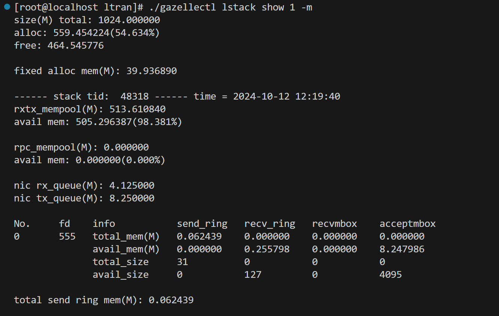

# Gazelle 内存资源可视化

在配置文件中，和 gazelle 内存分配相关的配置参数主要是：

- ["--socket-mem", "2048,0,0,0" ...]：大页内存分配
- tcp_conn_count、mbuf_count_per_conn：在创建 rxtx_pktspool 时分配的 mbuf 数量
- nic_rxqueue_size、nic_txqueue_size：网卡收发包队列长度
- rpc_msg_max：rpc 消息内存池大小

因此，针对可调整的配置参数相关内存，为 gazellectl lstack show 增加`"-m, memory [time] [interval] show lstack memory usage \n"`功能，启动 gazelle 后实现结果如下：

各参数说明如下：

- `total`：实际为 gazelle 配置的大页内存的大小
- `alloc`：gazelle 中已经实际分配的大页内存
- `free`：还未进行分配的大页内存

- `fixed alloc mem`：初始化 gazelle 之后，固定需要分配的大页内存

对于每一个 lstack 线程，为其大页内存使用展示如下信息：

- `rxtx_mempool`：gazelle 为每一个 lstack 线程分配的 `rxtx_pktmbuf_pool`的内存池
- `rpc_mempool`：gazelle 为每个线程创建的 `rpc_pool`内存池
- `avail mem`：内存池中未被分配的内存大小
- `nic rx_queue & nic tx_queue`：网卡接收和发送队列的深度

同时一个 lstack 会管理多个 socket 连接，针对每个 socket 展示的内存种类包括：send_ring 、recv_ring、 recvmbox、 acceptmbox 

- `total_mem`：表示该 ring 中已添加的 mbuf 的内存大小
- `total_size`：表示该 ring 中已添加的 mbuf 的个数
- `avail_mem`：表示该 ring 中未添加的 mbuf 的内存大小
- `avail_size`：表示该 ring 中未添加的 mbuf 个数