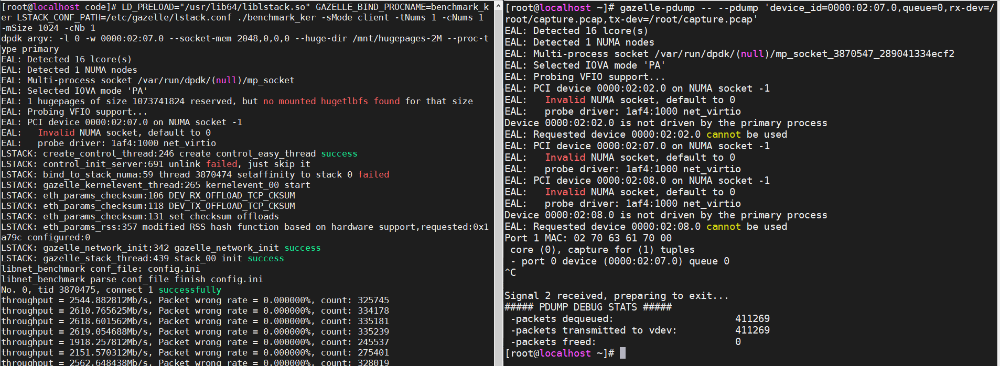
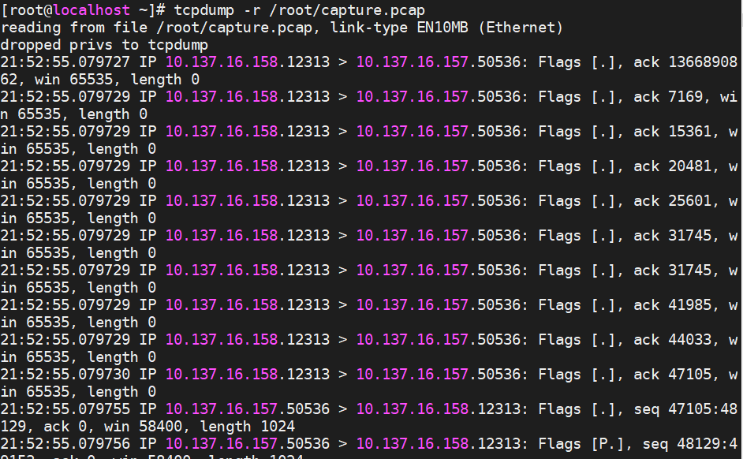

# Packet Capture with pdump

pdump acts as a subprocess of gazelle, sharing the network card driver receive and transmit queues to capture packets and write them to a file in pcap format. This file can be viewed with Wireshark.

The openEuler dpdk package provides the gazelle-pdump command for capturing packets with Gazelle.

## Commonly used parameters:

| Option        | Example Value    | Description |
| ------------- | ---------------- | ----------- |
| --file-prefix | gazelle          | Specifies the shared directory location of the main process. It needs to match the value in lstack.conf or ltran.conf. |
| device_id     | 0000:01:00.0     | PCI address of the capture network card. This needs to match the result from the dpdk-devbind -s command. |
| rx-dev        | /root/capture-rx.pcap | Location where the received data packets from the network card are stored. |
| tx-dev        | /root/capture-tx.pcap | Location where the transmitted data packets from the network card are stored. If this path is the same as rx-dev, the file will contain both received and transmitted data packets. |

For more parameter explanations:
```
gazelle-pdump --help
```

## Usage example:
```
gazelle-pdump --file-prefix gazelle -- --pdump 'device_id=0000:01:00.0,queue=*,rx-dev=/root/capture-rx.pcap,tx-dev=/root/capture-tx.pcap'
```


Use ctrl+C to stop the capture. Once the capture is complete, the data packets will be saved in pcap file format, which can be further processed using the `tcpdump` command.



The following command filters packets with a source IP of `192.168.1.10`:
```
tcpdump -r /root/capture.pcap src host 192.168.1.10 -w /root/filter-capture.pcap
```

## Common issues and solutions:

### Error message 1
```
Device 0000:02:08.0 is not driven by the primary process
EAL: Requested device 0000:02:08.0 cannot be used
Port 1 MAC: 02 70 63 61 70 00
PDUMP: client request for pdump enable/disable failed
PDUMP: client request for pdump enable/disable failed
PDUMP: client request for pdump enable/disable failed
```
Cause: The network card used by lstack/ltran and the one specified in gazelle-pdump do not match. Check the device_id parameter.

### Error message 2
```
EAL: Multi-process socket /var/run/dpdk/(null)/mp_socket_3884565_28c50010577fe
EAL: failed to send to (/var/run/dpdk/(null)/mp_socket) due to Connection refused
EAL: Fail to send request /var/run/dpdk/(null)/mp_socket:bus_vdev_mp
vdev_scan(): Failed to request vdev from primary
EAL: Selected IOVA mode 'PA'
EAL: Probing VFIO support...
EAL: failed to send to (/var/run/dpdk/(null)/mp_socket) due to Connection refused
EAL: Cannot send message to primary
EAL: error allocating rte services array
EAL: FATAL: rte_service_init() failed
EAL: rte_service_init() failed
```
Cause: The specified shared memory path for gazelle-pdump does not contain the appropriate files. Check the --file-prefix parameter.

### Error message 3
```
EAL: Failed to hotplug add device
EAL: Error - exiting with code: 1
  Cause: vdev creation failed:create_mp_ring_vdev:700
```
Cause: `lstack`/`ltran` is not linked to the dynamic library `librte_pmd_pcap.so(dpdk-19.11)`/`librte_net_pcap.so(dpdk-21.11)`. Check the compiled Makefile.

Here’s how to address it:
- Modify dpdk.spec to include PDUMP compilation options and recompile dpdk.
  
    `%build`
    ```
    sed -ri 's,(LIBRTE_PMD_PCAP=).*,\1y,' %{target}/.config
    ```

- Compile dpdk-pdump using the same compilation options as gazelle.

    The source file for pdump is located in the dpdk directory: `app/pdump/main.c`.

- Example compilation command (based on dpdk-19.11):
    ```
    cc -O0 -g -fno-strict-aliasing -mssse3 -I/usr/include/dpdk -fstack-protector-strong -Werror -Wall -fPIC -c -o main.o main.c
    ```

- Example linking command (based on dpdk-19.11):
    ```
    cc -lm -lpthread -lrt -lnuma -lconfig -lboundscheck -Wl,--whole-archive /usr/lib64/librte_pci.so /usr/lib64/librte_bus_pci.so /usr/lib64/librte_cmdline.so /usr/lib64/librte_hash.so /usr/lib64/librte_mempool.so /usr/lib64/librte_mempool_ring.so /usr/lib64/librte_timer.so /usr/lib64/librte_eal.so /usr/lib64/librte_ring.so /usr/lib64/librte_mbuf.so /usr/lib64/librte_kni.so /usr/lib64/librte_gro.so /usr/lib64/librte_pmd_ixgbe.so /usr/lib64/librte_kvargs.so /usr/lib64/librte_pmd_hinic.so /usr/lib64/librte_pmd_i40e.so /usr/lib64/librte_pmd_virtio.so /usr/lib64/librte_bus_vdev.so /usr/lib64/librte_net.so /usr/lib64/librte_ethdev.so /usr/lib64/librte_pdump.so /usr/lib64//librte_pmd_pcap.so main.o -Wl,--no-whole-archive -Wl,--whole-archive -Wl,--no-whole-archive -o gazelle-pdump
    ```

Ensure that the dynamic libraries in the linking command and the compilation options used for `liblstack.so` are the same as those in the Makefile.
