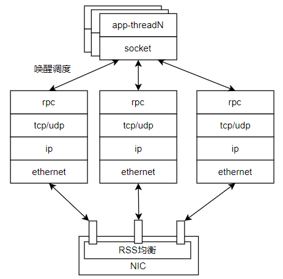
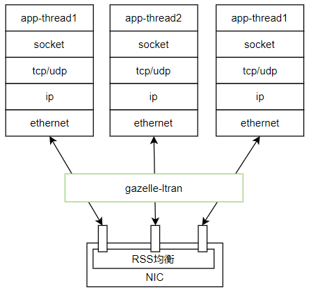
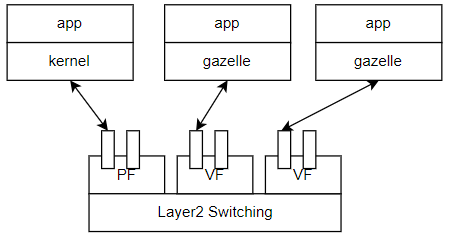
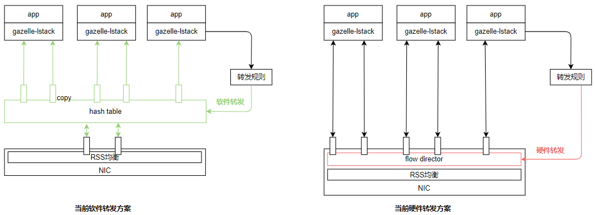
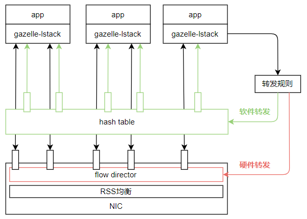
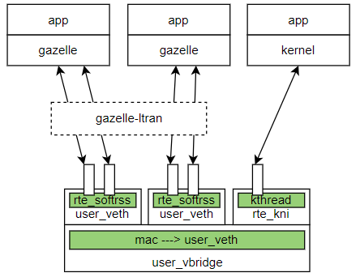

## 设计理念

* 协议栈绑定独立的cpu、网卡队列，轮询模式收包，避免中断和调度开销。
* 协议栈使用独立的内存池和线程资源（线程化的全局变量、arp/udp/tcp表等），避免锁竞争和cache miss，线性可扩展。
* 请求通过网卡硬件均衡 (RSS / flow director)，或者软件均衡 (hash table) ，分发流量到各协议栈。
* 提供标准POSIX API，应用零修改。


## 线程模型

### 1、分离线程模型 

  

* 适用场景：业务线程数量很多，支持fd跨线程使用。（通用场景）
* 协议栈线程和业务线程分离：类似linux内核协议栈的软中断实现，收到请求时由协议栈唤醒业务线程。
* 高速无锁读写：业务线程`recv/send`通过无锁队列读写报文数据，不与协议栈产生锁竞争。其他控制面socket请求通过`rpc`发送到协议栈线程。

### 2、共线程模型

  

* 适用场景：业务网络线程数量不多，数量固定。业务线程fd不跨线程使用。
* 协议栈和业务共线程：业务和协议栈在一个上下文运行，`poll/epoll`内执行协议栈轮询收包。
* 极致性能：独占cpu，不需要唤醒调度，但是业务处理时间长可能导致协议栈丢包。
* 各业务线程可能`listen`不同port、或者网卡队列数小于线程数，这时需要**流量均衡与转发**。


## 多进程模式 

### 1、进程独占网卡

  

* `SR-IOV`网卡硬件虚拟化是一个应用普遍的技术，一个网卡PF可以虚拟出多个VF网卡，共享网卡带宽。
* PF/VF通过网卡硬件switch基于二层转发，网卡间转发会做DMA拷贝。因此各网卡可以分别绑定内核态、用户态驱动。
* 兼容内核协议栈，gazelle不支持的协议或者不需要加速的流量交给内核网卡处理，且不像dpdk kni一样有较高地性能损耗。

```sh
# 每个PF支持32队列，每个PF支持的VF是3个，VF队列数是1个
0000:7d:00.1 'HNS GE/10GE/25GE Network Controller a221' if=enp125s0f1 drv=hns3 unused=hclge

# 每个PF支持16队列，每个PF支持的VF是60个，VF队列数是4个
# 每个PF支持64队列，每个PF支持的VF是24个，VF队列数是8个
0000:03:00.0 'Hi1822 Family (4*25GE) 1822' if=enp3s0 drv=hinic unused=

# 每个PF支持63队列，每个PF支持的VF是8个，VF队列数是11个
0000:01:00.0 'MT27710 Family [ConnectX-4 Lx] 1015' if=enp1s0f0 drv=mlx5_core unused= *Active*

# 每个PF支持63队列，每个PF支持的VF是63个，
0000:03:00.0 '82599ES 10-Gigabit SFI/SFP+ Network Connection 10fb' if=enp3s0f0 drv=ixgbe unused= 
```

### 2、进程共用网卡

* 适用场景：网卡数量不够，需要多个进程共用一个网卡。但是进程隔离性可能较差。
* 各业务进程/线程可能`listen`不同port、或者网卡队列数小于线程数，这时需要**流量均衡与转发**。

  

当前ltran软件转发方案：隔离性好，性能差

* 设计理念：进程隔离思想，业务进程重启互不影响。
* ltran作为独立的转发进程，收发线程额外占用cpu，单核收、单核发。
* ltran使用物理网卡，业务使用软件队列。
* 为了防止内存泄露，跨进程有报文拷贝。

当前硬件转发方案：隔离性差，性能好

* 各进程采用dpdk主从进程模式，共享一个大页内存地址空间，报文在进程间转发时不进行拷贝。
* 各进程由于共享大页地址空间，直接使用网卡队列，多进程间没有隔离。为防止内存泄露，必须将这些进程看作整体，同时启动、退出。
* Flow Director 硬件转发功能不普及。
* 网卡队列数量是固定，在初始化时确定，支持协议栈线程数量固定。

### 3、流量均衡与转发

设计目标：

* 融合“软件转发方案”和“硬件转发方案”。
* 去除中心转发节点和跨进程拷贝，进程异常退出不能泄露资源。

  

#### 软件转发方案

* 不作为独立线程额外分配cpu，在协议栈网卡收包后执行。
* 基于dpdk hash表实现，支持`并发写并发读`。
* 各网卡硬件队列对应分配一个软件队列，通过软件队列分发报文到其他线程。软件队列采用`多生产者单消费者模式`。

#### 内存回收方案

需要一个管理节点，监控进程状态，在进程正常/异常退出时回收资源。

启动一个协议栈线程：

* queue_alloc：申请一个queue_id，表示网卡硬件队列、软件转发队列，用于收发报文。

* rule_add：在`connect/listen`时添加转发规则，执行`close`时删除转发规则。

* memp_alloc：申请一系列memp（几十个左右），用于协议栈的定长结构体内存池。

    注意：需要创建一个`memp_list`存储协议栈线程的所有memp，用于释放。

* mbuf_alloc：每个queue_id绑定了mbufpool，申请mbuf用于收发报文。

    注意：当发生**软件转发**或**进程间loopback**时，会导致mbuf跨进程传递。进程异常退出时需要回收mbuf。

退出一个协议栈线程：

* queue_free：释放queue_id，此队列报文暂时会出现**丢包**。

* rule_delete：遍历协议栈的`tcp连接表、udp连接表`，删除转发规则。

* memp_free：遍历`memp_list`释放所有的memp。

* mbuf_free：通过`rte_mempool_walk()`遍历mbufpool，通过`rte_mempool_obj_iter`遍历mbufpool的所有mbuf，回收未释放的mbuf。


## DT测试

  

当前问题：

* 要求物理网卡/虚拟网卡、两台主机；用例自动化程度低；只覆盖了“ltran软件转发方案”。

设计目标：

* 不依赖硬件环境（一台主机，不要求物理/虚拟网卡），一键自动化部署，快速（10分钟内出结果）。作为开发门禁。
* 设计一种用户态虚拟网卡`user-veth`，使用软件队列模拟网卡硬件队列，`rte_softrss`模拟rss均衡。
* 设计一种虚拟网桥`user-vbridge`，使用hash模拟二层转发。
* 当测试网卡启动、硬件offload、网络性能时，才要求物理网卡。如果只有一台主机，可通过`SR-IOV`虚拟出多个VF网卡测试。


## 性能调优 - TODO

* `rte_trace` 
* `rte_metrics` 

