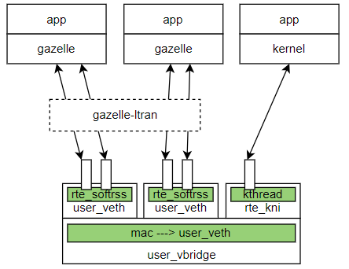

## Design Principles

* Bind the protocol stack to independent CPUs and NIC queues, using polling mode for packet reception to avoid interrupt and scheduling overhead.
* Utilize separate memory pools and thread resources for the protocol stack (e.g., thread-local variables, ARP/UDP/TCP tables) to minimize lock contention and cache misses, ensuring linear scalability.
* Distribute requests across NIC hardware (RSS/flow director) or software (hash table) for load balancing, directing traffic to different protocol stacks.
* Provide a standard POSIX API with zero modifications required for applications.

## Thread Models

### 1. Separate Thread Model

* Suitable for scenarios with a large number of business threads, supporting cross-thread FD usage (general use case).
* Separate protocol stack threads from business threads: similar to Linux kernel's soft interrupt implementation, the protocol stack wakes up business threads upon receiving requests.
* High-speed lock-free read/write: business threads `recv/send` data through lock-free queues, avoiding lock contention with the protocol stack. Other control plane socket requests are sent to protocol stack threads via RPC.

### 2. Shared Thread Model

* Suitable for scenarios where there are not many business network threads, and the number of threads is fixed. FDs are not shared across threads.
* Protocol stack and business threads share the same context: business and protocol stack run in the same context, executing packet polling within `poll/epoll`.
* Ultimate performance: exclusive CPU usage without the need for wake-up scheduling, but long business processing times may lead to packet loss in the protocol stack.
* Each business thread may `listen` on different ports or have fewer NIC queues than threads, requiring **traffic balancing and forwarding**.

## Multi-Process Mode

### 1. Process Exclusive NIC

* SR-IOV NIC hardware virtualization is a widely used technology, where a NIC PF can virtualize multiple VF NICs, sharing NIC bandwidth.
* PF/VF virtualization is based on hardware switch for layer 2 forwarding, with DMA copying between NICs. Hence, each NIC can be bound separately to kernel-space and user-space drivers.
* Compatible with kernel protocol stack, allowing non-accelerated or unsupported protocols to be handled by the kernel NIC without significant performance loss.

### 2. Process Shared NIC

* Suitable for scenarios where the number of NICs is limited, and multiple processes need to share a single NIC. However, process isolation may be poor.
* Each business process/thread may `listen` on different ports or have fewer NIC queues than threads, requiring **traffic balancing and forwarding**.

Current software forwarding solution (ltran): good isolation, poor performance

* Design philosophy: process isolation, no impact on other business processes upon restart.
* ltran acts as an independent forwarding process, with separate CPU usage for receive and transmit threads, one core each.
* ltran uses a physical NIC, while business processes use software queues.
* To prevent memory leaks, there is packet copying across processes.

Current hardware forwarding solution: poor isolation, good performance

* Each process adopts the dpdk master-slave process mode, sharing a large page memory address space, with packets forwarded between processes without copying.
* Due to shared large page address space, there is no isolation between processes. To prevent memory leaks, these processes must be treated as a whole, started and stopped together.
* Flow Director hardware forwarding functionality is not universal.
* The number of NIC queues is fixed and determined during initialization, supporting a fixed number of protocol stack threads.

### 3. Traffic Balancing and Forwarding

Design goals:

* Integrate software and hardware forwarding solutions.
* Remove central forwarding nodes and cross-process copying, preventing resource leaks upon process abnormal termination.

#### Software Forwarding Solution

* No additional CPU allocation as an independent thread; executed after packet reception in the protocol stack.
* Implemented based on dpdk hash tables, supporting concurrent read and write.
* Each NIC hardware queue corresponds to a software queue, distributing packets to other threads via software queues. Software queues adopt a multiple producers/single consumer model.

#### Memory Reclamation Solution

Requires a management node to monitor process states and reclaim resources upon normal/abnormal process termination.

Upon starting a protocol stack thread:

* queue_alloc: allocate a queue_id, representing the NIC hardware queue and software forwarding queue, used for packet reception and transmission.
* rule_add: add forwarding rules during `connect/listen`, and delete them during `close`.
* memp_alloc: allocate a series of memp (around dozens) for the protocol stack's fixed-length structure memory pool.
  Note: a `memp_list` is created to store all memp of protocol stack threads for release.
* mbuf_get: each queue_id is bound to an mbufpool, used for packet reception and transmission.

Upon exiting a protocol stack thread:

* queue_free: release queue_id, causing temporary packet loss for this queue.
* rule_delete: traverse the `tcp connection table` and `udp connection table` of the protocol stack to delete forwarding rules.
* memp_free: traverse `memp_list` to release all memp.
* mbuf_put: traverse mbufpool using `rte_mempool_walk()` and `rte_mempool_obj_iter` to reclaim unreleased mbufs.

## mbuf Memory Management

Packet Data Flow:

* `#1` Packet Reception:
  Each NIC queue is bound to an L1_mbufpool. Mbufs are allocated by the NIC driver and released by Gazelle.

* `#2` Packet Transmission:
  Gazelle requests mbufs from the L1_mbufpool, and after the NIC finishes transmission, the mbufs are released.

* `#3` Packet Transmission with Memory Pressure:
  When memory is tight due to a high number of connections, i.e., when the L1_mbufpool falls below the low watermark, an L2_mbufpool is created for transmission.

Mbufpool Contention Issues:

* Per-connection cache is replaced with per-CPU cache, as referenced in `rte_mempool_default_cache()`.
* When the mbufpool falls below the low watermark, the `rte_lcore_id()` flag is turned off, and a scan is conducted to reclaim memory from per-CPU caches.

## DT Testing

Current Issues:

* Requires physical/virtual NICs and two hosts; low level of test automation; only covers the "ltran software forwarding solution".

Design Objectives:

* No dependency on hardware environment (single host, no requirement for physical/virtual NICs), one-click automation deployment, rapid results (within 10 minutes). Serve as a development barrier.
* Design a user-space virtual NIC, `user-veth`, simulating NIC hardware queues using software queues, with `rte_softrss` simulating RSS load balancing.
* Design a virtual bridge, `user-vbridge`, using hashing to simulate layer 2 forwarding.
* Test physical NIC startup, hardware offload, and network performance only when necessary. If only one host is available, multiple VF NICs can be virtualized using `SR-IOV` for testing.

## Performance Tuning - TODO

* `rte_trace`
* `rte_metrics`
