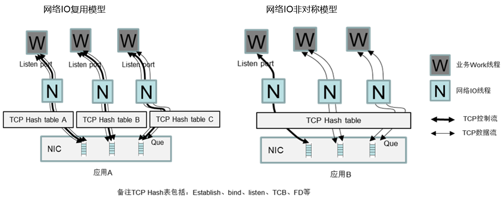
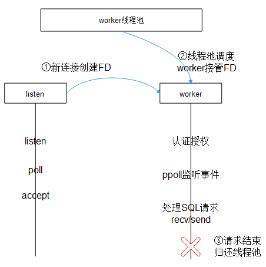
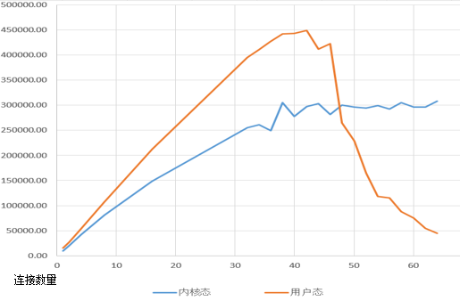
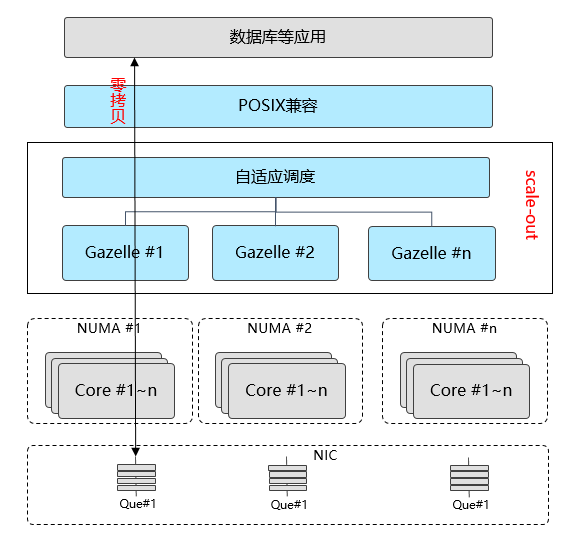
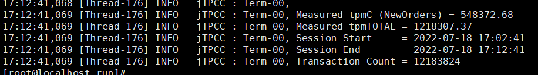
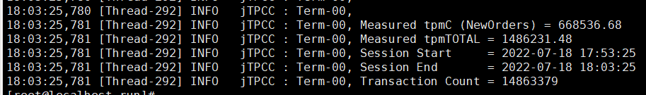
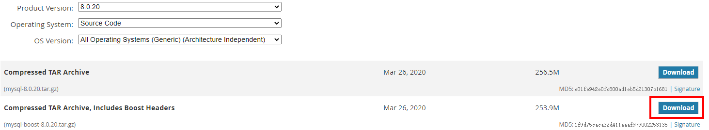
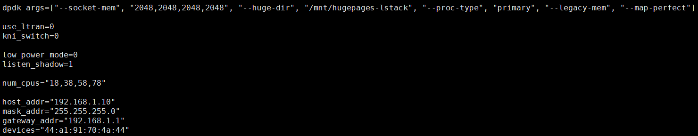

 

# 实践系列(一)Gazelle加速mysql 20%

## 背景介绍

   当前网卡性能提升速度远远快于单核CPU，单核CPU已无法充分利用网卡带宽发展红利。同时cpu朝着多核方向发展，NUMA体系结构是现在众核解决方案之一。从硬件视角看解决CPU/网卡之间的算力差距，主要是两种方案，将CPU工作卸载到网卡，硬件加速方案；将NUMA体系结构充分利用起来，软件加速方案。下意识可能都会认为硬件加速方案更快，但是实测中，Gazelle软件加速性能提升更多，后续文章会详讲，主要是数据高效传递到应用这一段路径，Gazelle处理的更好。 
 

现在软件的编程模型非常多样，但是可以总结出2类典型的网络模型，如下图：
- IO复用模型：应用A网络线程之间完全隔离，协议状态上下文固定在某个线程内
- 非对称模型：应用B网络线程之间非对称，协议状态上下文会在多个线程之间迁移 



## 提升mysql性能遇到的问题

​		mysql的网络模型属于上述非对称模型，TCP会跨线程迁移。目前业界常见的用户态协议栈都是针对非对称应用设计（如f-stack），不能支持TCP跨线程迁移常见；或使用全局的TCP资源（如lwip），当连接数超过40时，因为竞争问题性能迅速恶化。



## Gazelle方案

​		Gazelle是一款高性能用户态协议栈。它基于DPDK在用户态直接读写网卡报文，共享大页内存传递报文，使用轻量级LwIP协议栈。能够大幅提高应用的网络I/O吞吐能力。专注于数据库网络性能加速，如MySQL、redis等。兼顾高性能与通用性：
- 高性能：报文零拷贝，无锁，灵活scale-out，自适应调度。
- 通用性 ：完全兼容POSIX，零修改，适用不同类型的应用。 

​       Gazelle解耦应用线程与协议栈线程，从而支持任意的线程模型。通过应用线程fd与协议栈线程sock的路由表，应用线程的read/write等操作能在对应的协议栈线程执行。Gazelle是多核多线程部署，通过区域化大页内存，避免NUMA陷阱。

 技术特征

- POSIX兼容

- DPDK bypass 内核

- 区域化大页内存管理，避免NUMA陷阱

- 应用线程亲和性管理

- 分布式TCP Hash table，多核多线程工作模式

- 协议栈线程与应用线程解耦

- 报文高效传递到应用

 

 

效果如图，使用内核协议栈跑分为54.84万，使用Gazelle跑分为66.85万，Gazelle提升20%+：

## Gazelle加速mysql测试步骤

### 1. 环境要求

#### 1.1 硬件

要求服务端（Server）、客户端（Client）各一台

|          |          Server          |         Client          |
| :------- | :----------------------: | :---------------------: |
| CPU      |   Kunpeng 920-4826 * 2   |  Kunpeng 920-4826 * 2   |
| 主频     |         2600MHz          |         2600MHz         |
| 内存大小 | 12 * 32G Micron 2666 MHz | 8 * 32G Micron 2666 MHz |
| 网络     |         1822 25G         |        1822 25G         |
| 系统盘   |     1.1T HDD TOSHIBA     |    1.1T HDD TOSHIBA     |
| 数据盘   |    3T HUAWEI SSD NVME    |           NA            |

#### 1.2 软件

软件包默认使用openEuler 22.03的yum源

|   软件名称   |  版本  |
| :----------: | :----: |
|    mysql     | 8.0.20 |
| benchmarksql |  5.0   |

#### 1.3 组网


### 2. Server端部署

#### 2.1 安装mysql依赖包

```sh
yum install -y cmake doxygen bison ncurses-devel openssl-devel libtool tar rpcgen libtirpc-devel bison bc unzip git gcc-c++ libaio libaio-devel numactl
```

#### 2.2 编译安装mysql

- 从[官网下载](https://downloads.mysql.com/archives/community/)下载源码包



- 下载优化补丁: [细粒度锁优化特性补丁](https://github.com/kunpengcompute/mysql-server/releases/download/tp_v1.0.0/0001-SHARDED-LOCK-SYS.patch)         [NUMA调度补丁](https://github.com/kunpengcompute/mysql-server/releases/download/21.0.RC1.B031/0001-SCHED-AFFINITY.patch)         [无锁优化特性补丁](https://github.com/kunpengcompute/mysql-server/releases/download/tp_v1.0.0/0002-LOCK-FREE-TRX-SYS.patch)    

- 编译mysql

  编译前确保已安装libaio-devel包

```sh
tar zxvf mysql-boost-8.0.20.tar.gz
cd mysql-8.0.20/
patch -p1 < ../0001-SHARDED-LOCK-SYS.patch
patch -p1 < ../0001-SCHED-AFFINITY.patch
patch -p1 < ../0002-LOCK-FREE-TRX-SYS.patch
cd cmake
make clean
cmake .. -DCMAKE_INSTALL_PREFIX=/usr/local/mysql-8.0.20  -DWITH_BOOST=../boost -DDOWNLOAD_BOOST=1
make -j 64
make install
```

#### 2.3 配置mysql参数

使用gazelle源码中doc/conf/my.cnf-arm配置文件，放到/etc目录重命名为my.cnf

#### 2.4 部署mysql

```sh
#挂载nvme盘
mkdir -p /data
mount  /dev/nvme0n1 /data
mkdir -p /data/mysql
mkdir -p /data/mysql/data
mkdir -p /data/mysql/share
mkdir -p /data/mysql/tmp
mkdir -p /data/mysql/run
mkdir -p /data/mysql/log

#创建用户组
groupadd mysql
useradd -g mysql mysql
chown -R mysql:mysql /data
chown -R mysql:mysql /data/mysql/log/mysql.log

#初始化
echo "" > /data/mysql/log/mysql.log
rm -fr /data/mysql/data/*
/usr/local/mysql-8.0.20/bin/mysqld  --defaults-file=/etc/my.cnf --user=root --initialize

#启动服务
/usr/local/mysql-8.0.20/support-files/mysql.server start

#完成初始化后会随机生成一个密码，用其登录mysql
/usr/local/mysql-8.0.20/bin/mysql -u root -p
alter user 'root'@'localhost' identified by '123456';
flush privileges;
quit

#再次登录数据库，密码123456，更新root账号能够访问的域为%，从而可以支持远程访问
/usr/local/mysql-8.0.20/bin/mysql -u root -p
use mysql;
update user set host='%' where user='root';
flush privileges;
create database tpcc;
quit

#先关闭服务，后面测试启动生效配置
/usr/local/mysql-8.0.20/support-files/mysql.server stop
```

### 3. client部署benchmarksql工具

- 编译安装

下载 [benchmarksql工具](https://mirrors.huaweicloud.com/kunpeng/archive/kunpeng_solution/database/patch/benchmarksql5.0-for-mysql.zip)

```sh
#安装benchmarksql依赖包
yum install -y java

unzip benchmarksql5.0-for-mysql.zip
cd benchmarksql5.0-for-mysql/run
chmod +x *.sh
```

- 配置benchmarksql参数

  benchmarksql5.0-for-mysql/run/props.conf

  | 配置项    | 值   | 描述                           |
  | --------- | ---- | ------------------------------ |
  | Terminals | 300  | 压力测试的并发数量。           |
  | runMins   | 10   | 压力测试运行时间（单位：分钟） |
  | conn      | ip   | 修改默认IP为服务端IP           |

### 4. mysql创建测试数据

```sh
#启动服务
/usr/local/mysql-8.0.20/support-files/mysql.server start

#创建测试数据(创建数据大约45分钟，完成测试数据创建后，建议对server端/data/mysql/data下数据进行备份,之后测试，数据从此拷贝即可)
./runDatabaseBuild.sh props.conf

#停止数据库
/usr/local/mysql-8.0.20/support-files/mysql.server stop
```


### 5. 配置执行环境

#### 5.1 开启STEAL优化

服务端开启STEAL优化

1. 在linux系统启动项添加参数`sched_steal_node_limit=4`，reboot重启生效

```sh
[root@localhost mysql]# cat /proc/cmdline
BOOT_IMAGE=/vmlinuz-5.10.0-153.12.0.89.oe2203sp2.aarch64 root=/dev/mapper/openeuler-root ro rd.lvm.lv=openeuler/root rd.lvm.lv=openeuler/swap video=VGA-1:640x480-32@60me cgroup_disable=files apparmor=0 crashkernel=1024M,high smmu.bypassdev=0x1000:0x17 smmu.bypassdev=0x1000:0x15 console=tty0 sched_steal_node_limit=4 
```

2. 重启后开启STEAL

```sh
echo STEAL > /sys/kernel/debug/sched_features
```

#### 5.2 关闭测试影响项

```sh
#关闭irqbalance
systemctl stop irqbalance.service
systemctl disable irqbalance.service

#关闭防火墙
systemctl stop iptables
systemctl stop firewalld
```

### 6. 内核协议栈测试mysql

```sh
#服务端绑中断(根据环境替换网卡名称、绑核cpu核)
ethtool -L enp4s0 combined 5
irq1=`cat /proc/interrupts| grep -E enp4s0 | head -n5 | awk -F ':' '{print $1}'`
cpulist=(91 92 93 94 95)
c=0
for irq in $irq1
do
echo ${cpulist[c]} "->" $irq
echo ${cpulist[c]} > /proc/irq/$irq/smp_affinity_list
let "c++"
done

#客户端执行mysql测试
./runBenchmark.sh props.conf

##恢复环境
#服务端使用备份数据恢复数据库，也可重新生成数据。
rm -fr /data/mysql/data/*
cp -fr /home/tpccdata/* /data/mysql/data/
#关闭mysql进程
pkill -9 mysqld
```

测试结果如下：


### 7. Gazelle测试mysql
安装软件包
```sh
yum -y install gazelle dpdk libconfig numactl libboundscheck libcap 
```

修改/etc/gazelle/lstack.conf配置文件修改如下

| 配置项        | 值                                                           | 描述                                                         |
| ------------- | ------------------------------------------------------------ | ------------------------------------------------------------ |
| dpdk_args     | ["--socket-mem", "2048,2048,2048,2048", "--huge-dir", "/mnt/hugepages-lstack", "--proc-type", "primary", "--legacy-mem", "--map-perfect"] | 配置每个NUMA使用2G内存（也可以更小），大页内存挂载目录       |
| use_ltran     | 0                                                            | 不使用ltran                                                  |
| listen_shadow | 1                                                            | 使用listen影子fd，因为mysql一个listen线程对应4个协议栈线程   |
| num_cpus      | "18,38,58,78"                                                | 每个NUMA选择一个cpu                                          |



```sh
#服务端分配大页
echo 8192 > /sys/kernel/mm/hugepages/hugepages-2048kB/nr_hugepages #根据实际选择pagesize
mkdir -p /mnt/hugepages-lstack
mount -t hugetlbfs nodev /mnt/hugepages-lstack #不能重复操作，否则大页被占用不能释放

#服务端加载ko
modprobe vfio enable_unsafe_noiommu_mode=1
modprobe vfio-pci

#服务端绑定网卡到用户态
ip link set enp4s0 down
dpdk-devbind -b vfio-pci enp4s0

#服务端启动mysqld
LD_PRELOAD=/usr/lib64/liblstack.so GAZELLE_BIND_PROCNAME=mysqld /usr/local/mysql-8.0.20/bin/mysqld --defaults-file=/etc/my.cnf --bind-address=192.168.1.10 &

#客户端执行mysql测试
./runBenchmark.sh props.conf

##恢复环境
#服务端使用备份数据恢复数据库，也可重新生成数据。
rm -fr /data/mysql/data/*
cp -fr /home/tpccdata/* /data/mysql/data/
#关闭mysql进程
pkill -9 mysqld
```
Gazelle部署详见[Gazelle使用指南](Gazelle使用指南.md)

测试结果如下:


