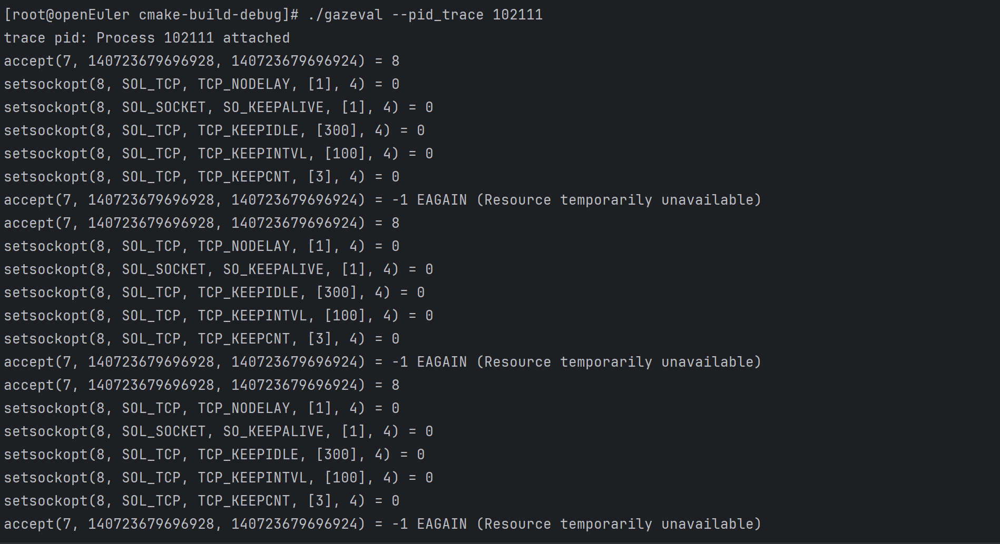
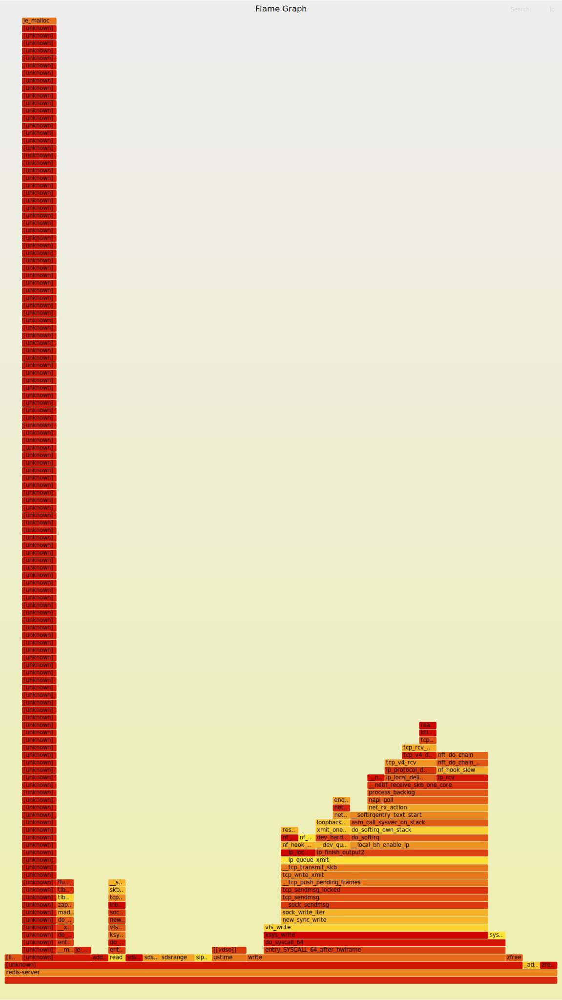

# gztrace

## Usage
Usage: gztrace [options]
Options:
+ -h, --help           : Show this help message
+ -l, --list           : List POSIX APIs that Gazelle supports
+ -t, --trace <cmd>    : Trace executable's (network) POSIX API
+ --pid_trace <pid>: Trace a specific PID's (network) POSIX API
+ -r, --record <cmd>   : Capture and record executable's call stack information for performance analysis
+ --pid_record <pid>: Capture and record a PID's call stack information for performance analysis
+ -m, --multiplex <cmd>: Monitor IO multiplexing mechanisms in the target application
+ --pid_multiplex <pid>: Monitor IO multiplexing mechanisms in the target pid
## Current Capabilities
+ 打印gazelle支持的posix api 接口
+ 探测目标应用/进程支持的网络类posix接口类型
+ 打印目标应用/进程支持的网络类posix接口参数的详细信息，支持的有：
  + setsockopt
  + getsockopt
  + socket
  + connect
  + recvfrom
  + getpeername
  + sendto
  + getsockname
  + accept
+ 可以利用perf抓取目标应用或进程的性能数据并生成火焰图。
+ 获取目标应用/进程支持的IO多路复用机制。
## Examples
### redis
#### 探测redis所在进程网络类posix api调用
+ 1 启动redis，查看redis-server所在进程,使用gztrace捕捉对应进程
  
+ 2 在redis-server执行基本的 Redis 命令
```shell
redis-cli set key1 value1
redis-cli get key1
redis-cli del key1

```
gztrace捕捉结果：


+ 3 执行`MSET` 和 `MGET` 命令：
```shell
redis-cli mset key1 value1 key2 value2 key3 value3
redis-cli mget key1 key2 key3

```
gztrace捕捉结果：


+ 4 执行`PUBLISH` 和 `SUBSCRIBE`操作
  + 在一个终端窗口中，运行 Redis 订阅命令：
    ```redis-cli subscribe mychannel  ```
  + 在另一个终端窗口中，发布一条消息：
    ```redis-cli publish mychannel "Hello, World!" ```
    gztrace捕捉结果：
    

#### 抓取redis-server所在进程的火焰图
+  1 启动redis，查看redis-server所在进程,使用gztrace记录对应进程
```shell
./gztrace --pid_record <pid>
git clone https://github.com/brendangregg/FlameGraph.git
./FlameGraph/stackcollapse-perf.pl out.perf > out.folded
./FlameGraph/flamegraph.pl out.folded > ./flamegraph.svg

```
  
+ 2 在redis-server 使用 redis-benchmark 模拟高并发的 `set` 和 `get`操作 

```shell
redis-benchmark -n 1000 -c 10 -t set,get
```
对应火焰图：

+ 3 使用管道批量执行 100000 次 `PING` 命令，每次批量 16 个命令，并发 100 个客户端：

``` shell
redis-benchmark -n 100000 -c 100 -P 16 -t ping
```
对应火焰图：


+ 4 模拟 10000 次 LRANGE 操作，每次并发 50 个客户端，获取列表中的 100 个元素：
```shell
redis-benchmark -n 10000 -c 50 -t lrange -r 10000 -d 100
```
对应火焰图：

#### 获取目标应用/进程支持的IO多路复用机制
启动redis，使用以下命令探测redis-server所在进程的多路复用机制
```shell
 ./gztrace --pid_multiplex <pid>
```


### others
+ 1 探测应用Posix接口
  + `./gztrace -t "curl baidu.com`
    
+ 2 抓取目标应用性能数据，并生成火焰图
  + `./gztrace -e "ls /usr/bin"`
    
  + 利用性能数据生成火焰图：
    `git clone https://github.com/brendangregg/FlameGraph.git`
    `./FlameGraph/stackcollapse-perf.pl out.perf > out.folded`
    `./FlameGraph/flamegraph.pl out.folded > ./flamegraph.svg`
    
  + 用浏览器查看火焰图：
    


+ 3 抓取目标进程的性能数据，并生成火焰图
  + `stress-ng --cpu 1 --timeout 600`  
    
  + 用top查看stress-ng对应的进程：
    
  + `./gztrace --pid_trace <pid>`
    
  + 等待1分钟以上，ctrl+c退出gztrace
  + `git clone https://github.com/brendangregg/FlameGraph.git`
    `./FlameGraph/stackcollapse-perf.pl out.perf > out.folded`
    `./FlameGraph/flamegraph.pl out.folded > ./flamegraph.svg`
    
  + 用浏览器查看火焰图：
    
+ 4 获取目标应用支持的IO多路复用机制。
  +  gztrace -m "curl baidu.com"
     


