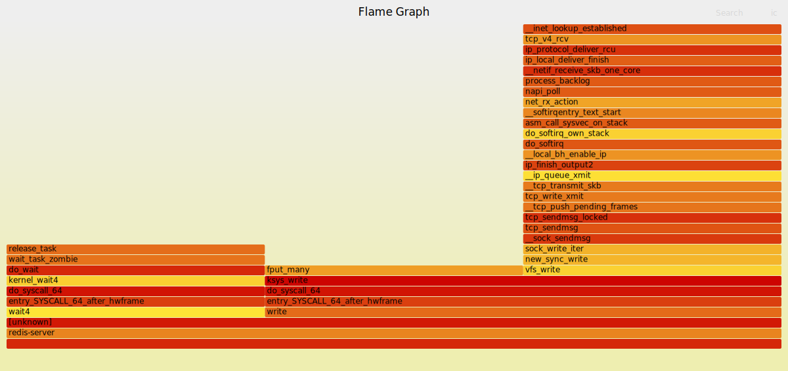

# gazeval

## Usage
Usage: gztrace [options]
Options:
+ -h, --help           : Show this help message
+ -l, --list           : List POSIX APIs that Gazelle supports
+ -r, --record <cmd>   : Capture and record executable's call stack information for performance analysis
+ --pid_record <pid>: Capture and record a PID's call stack information for performance analysis
## Current Capabilities
+ 打印gazelle支持的posix api 接口
+ 可以利用perf抓取目标应用或进程的性能数据并生成火焰图。
## Examples

#### 抓取redis-server所在进程的火焰图
+  1 启动redis，查看redis-server所在进程,使用gztrace记录对应进程
```shell
./gazeval --pid_record <pid>
git clone https://github.com/brendangregg/FlameGraph.git
./FlameGraph/stackcollapse-perf.pl out.perf > out.folded
./FlameGraph/flamegraph.pl out.folded > ./flamegraph.svg

```
  
+ 2 在redis-server 使用 redis-benchmark 模拟高并发的 `set` 和 `get`操作 

```shell
redis-benchmark -n 1000 -c 10 -t set,get
```
对应火焰图：
   
+ 3 使用管道批量执行 100000 次 `PING` 命令，每次批量 16 个命令，并发 100 个客户端：

``` shell
redis-benchmark -n 100000 -c 100 -P 16 -t ping
```
对应火焰图：
   

+ 4 模拟 10000 次 LRANGE 操作，每次并发 50 个客户端，获取列表中的 100 个元素：
```shell
redis-benchmark -n 10000 -c 50 -t lrange -r 10000 -d 100
```
对应火焰图：


#### 抓取目标应用性能数据，并生成火焰图 
  + `./gazeval -e "ls /usr/bin"`
      
  + 利用性能数据生成火焰图：
    `git clone https://github.com/brendangregg/FlameGraph.git`
    `./FlameGraph/stackcollapse-perf.pl out.perf > out.folded`
    `./FlameGraph/flamegraph.pl out.folded > ./flamegraph.svg`
    
  + 用浏览器查看火焰图：
    

#### 抓取目标进程的性能数据，并生成火焰图
  + `stress-ng --cpu 1 --timeout 600`  
    
  + 用top查看stress-ng对应的进程：
     
  + `./gazeval --pid_trace <pid>`
    
  + 等待1分钟以上，ctrl+c退出gazeval
  + `git clone https://github.com/brendangregg/FlameGraph.git`
    `./FlameGraph/stackcollapse-perf.pl out.perf > out.folded`
    `./FlameGraph/flamegraph.pl out.folded > ./flamegraph.svg`
    
  + 用浏览器查看火焰图：
    


